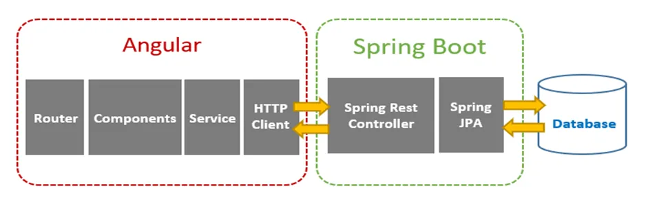

# RoleEditor

This project was generated with [Angular CLI](https://github.com/angular/angular-cli) version 17.3.0.

**Application Overview**



***Backend Repository***: [role-editor-backend](https://github.com/soumyabrata09/role-editor-backend.git)

## Development server

Run `ng serve` for a dev server. Navigate to `http://localhost:3003/`. The application will automatically reload if you change any of the source files.

## Code scaffolding

Run `ng generate component component-name` to generate a new component. You can also use `ng generate directive|pipe|service|class|guard|interface|enum|module`.

## Build

Run `ng build` to build the project. The build artifacts will be stored in the `dist/` directory.

## Running unit tests

Run `ng test` to execute the unit tests via [Karma](https://karma-runner.github.io).

## Running end-to-end tests

Run `ng e2e` to execute the end-to-end tests via a platform of your choice. To use this command, you need to first add a package that implements end-to-end testing capabilities.

## OpenAPI contract generation
 
 > openapi file-location: src\assets\openapi.yaml
 

 Execute `npm run generate`

***Code generation command***:
```
ng-openapi-gen --input src/assets/openapi.yaml --output src/app/lib/generated
 ```

> This command will generate all the contracts from openapi specification, includin api and services

Execute `npm run generate:model`
> This Command will generate all the openapi specifications and then will only keep the models

> Custom Js file: delete-generated-files.js

**Following Dependencies added**
 - "ng-openapi-gen": "^0.51.0",
 - "rimraf": "^5.0.5",

## Further help

To get more help on the Angular CLI use `ng help` or go check out the [Angular CLI Overview and Command Reference](https://angular.io/cli) page.
